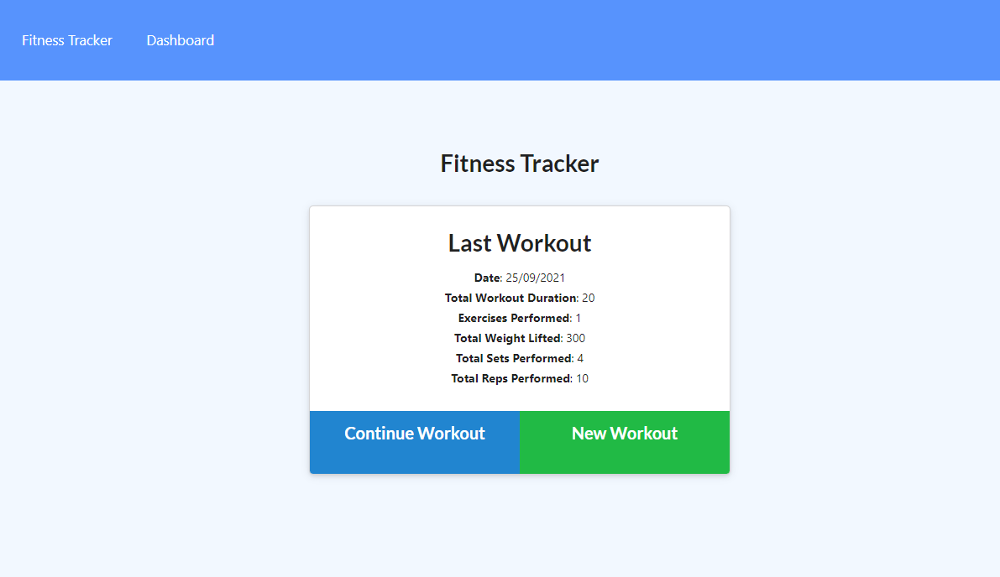
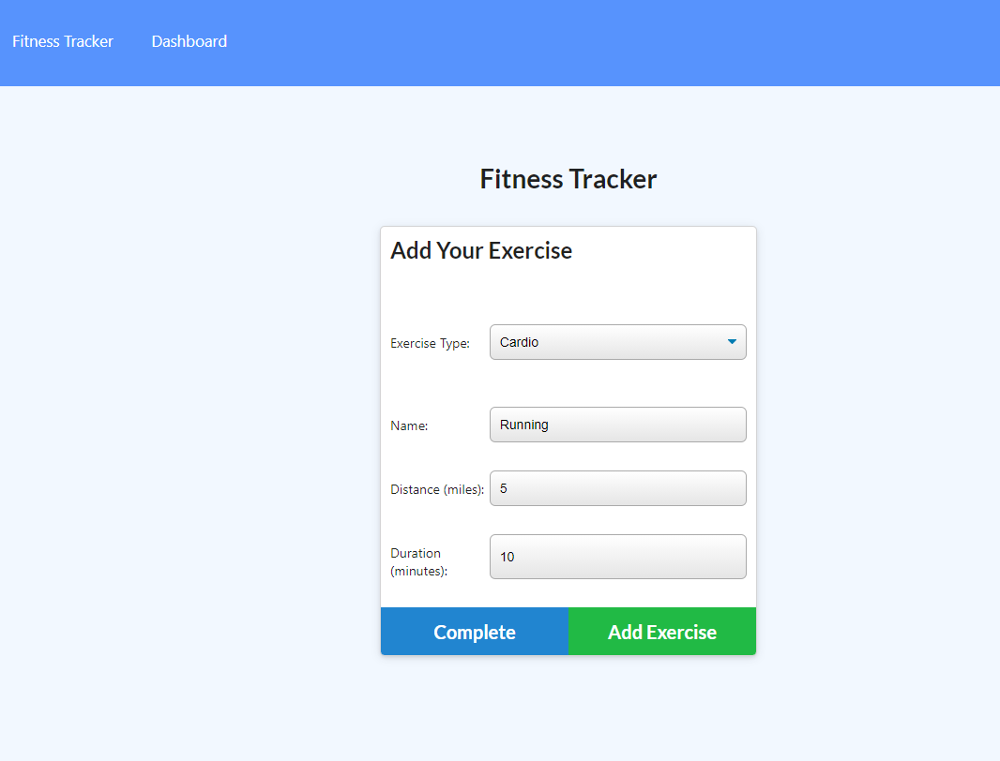
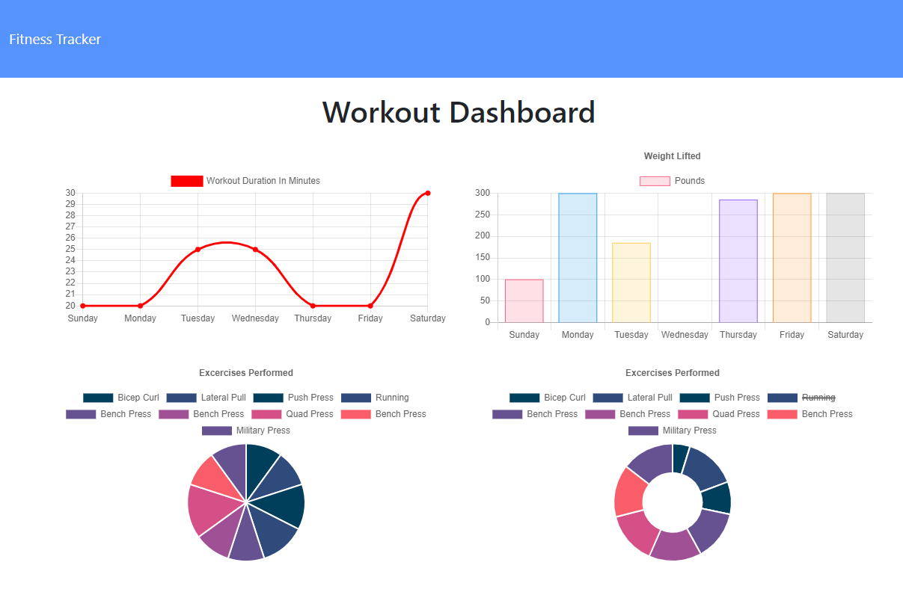

# Workout Tracker
Link to deployed application: https://raven-workouts.herokuapp.com/

Link to code repository: https://github.com/raven-bootcamp/workout-tracker

## Table of Contents
- [The Task](#the-task)
- [Instructions for Use](#instructions-for-use)
- [Technologies Used](#technologies-used)
- [User Story](#user-story)
- [Acceptance Criteria](#acceptance-criteria)
- [Screenshot of UI](#screenshot-of-ui)

## The Task
We have been provided some starter code and the task is to complete it, to build and finish a workout tracker.  The application uses a Mongo database with a Mongoose schema, and routes are handled using Express.

The features and functionality of the application is further described in the "User Story" and "Acceptance Criteria" sections.

## Instructions For Use

For local use, the assumption is that you have MongoDB installed and running on your local machine.

After checking out the code repository, in a command line, change to the directory where the code was checked out. 

Install the required library files using the following command:

`npm install`

Once everything is installed, ensure MongoDB server is running:

`mongod`

Seed the database with some sample data, if desired:

`npm run seed`

Finally, run the application with the following command:

`npm run start`

You can then use the application in your browser at the address `localhost:xxxx` , substituting the x characters with the port specified in the terminal.

## Technologies Used
- [Node.js](https://nodejs.org/en/)
- **NPM libraries and frameworks**:
    + [Express](https://www.npmjs.com/package/express) : framework for routing 
    + [Mongoose](https://www.npmjs.com/package/mongoose) : object modeling tool for MongoDB
    + [Morgan](https://www.npmjs.com/package/morgan) - HTTP request logger middleware
    + [Dotenv](https://www.npmjs.com/package/dotenv) : for the use of environment variables

## User Story
```
As a user, 
I WANT to be able to view create and track daily workouts. 
I WANT to be able to log multiple exercises in a workout on a given day. 
I SHOULD also be able to track the name, type, weight, sets, reps, and duration of exercise. 
IF the exercise is a cardio exercise, I should be able to track my distance traveled.
SO THAT I can maintain good health.
```

## Acceptance Criteria
```
When the user loads the page, they should be given the option to create a new workout or continue with their last workout.
The user should be able to:
- Add exercises to the most recent workout plan.
- Add new exercises to a new workout plan.
- View the combined weight of multiple exercises from the past seven workouts on the stats page.
- View the total duration of each workout from the past seven workouts on the stats page. 
```

## Screenshot of UI


